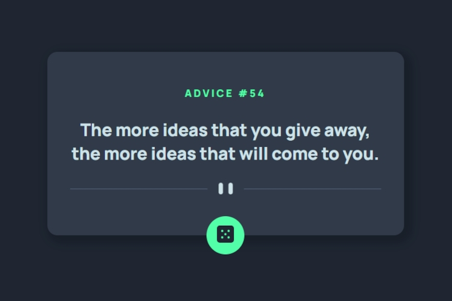

<h1 align="center">Diogo Silas's Advice Generator</h1>

## Tecnologias Utilizadas
- JavaScript - JS é uma linguagem de programação amplamente utilizada para desenvolvimento web. Versátil e dinâmica, executa no navegador do usuário, permitindo interatividade e manipulação de conteúdo em tempo real.

- Hyper Text Markup Language - HTML5 é a linguagem de marcação que viabiliza a criação de código semântico, de manutenção simplificada e legibilidade

- Cascading Style Sheets - CSS3, a linguagem de folha de estilo em cascata, é a força motriz por trás da criação de efeitos estéticos na página, englobando a manipulação de textos, imagens e adaptabilidade responsiva.

## Como Utilizar?

1. Clique no botão com a imagem de um dado com o número 05 (cinco) e espere alguns segundos para visualizar a frase.
